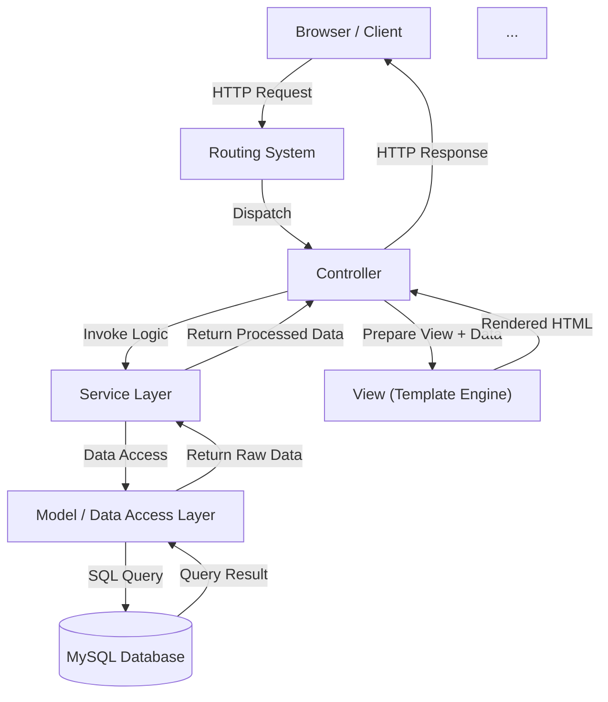

# 🎱 POOL SNACK - Sistem Pemesanan Snack Arena Billiard

  <strong>Final Project Mata Kuliah Rekayasa Perangkat Lunak</strong> 
  <em>Kelompok 6 - Sistem Pemesanan Digital untuk Arena Billiard</em>

  
  
  
  
  

---

## 📋 DAFTAR ISI
- [👥 Identitas Kelompok](#-identitas-kelompok)
- [📘 Dokumen Final](#-1-dokumen-final-pdf)
- [📱 Deskripsi & Masalah](#-deskripsi--masalah)
- [🏗 Arsitektur Sistem](#-arsitektur-sistem)
- [🔄 Metodologi & Sprint Log](#-metodologi--sprint-log)
- [🛠 Teknologi Pengembangan](#-teknologi-pengembangan)
- [⚙ Instalasi & Konfigurasi](#-instalasi--konfigurasi)
- [🚀 Cara Menjalankan](#-cara-menjalankan)
- [🔐 Akun Demo](#-akun-demo)
- [🌐 Link Deployment & Video](#-link-deployment--video-demo)
- [📸 Screenshot Sistem](#-screenshot-sistem)
- [📝 Keterangan Tugas](#-keterangan-tugas)

---

## 👥 IDENTITAS KELOMPOK
KELOMPOK 6 - MATA KULIAH REKAYASA PERANGKAT LUNAK

| No | Nama Lengkap | NIM | Peran & Tanggung Jawab |
|---:|--------------|-----:|------------------------|
| 1 | JIHAN NABILLAH | 701230022 | Fullstack Developer & Project Lead • Perancangan Arsitektur MVC & Database • Backend Development (Core System, Auth, Transaction) • Deployment & Server Configuration (InfinityFree) • System Integration Testing • Penyusunan Sprint Execution Log • Penyusunan Master Product Backlog • Penyusunan Activity Diagram  |
| 2 | DWI ASTINA | 701230030 | System Architect & QA • Penyusunan High Level Design (HLD) • Quality Assurance & Bug Tracking • Dokumentasi Teknis & User Manual • Validasi Standar RPL |
| 3 | SINTA ULAN DARI | 701230178 | UI/UX Designer & Analyst • Analisis Kebutuhan Fungsional (SRS) • Desain Mockup & Wireframe (Figma) • Frontend Implementation (Bootstrap Styling) • Penyusunan Use Case & Activity Diagram |

---

# 📘 1. Dokumen Final (PDF)
Semua dokumen final project juga diunggah dalam folder /dokumen.

### 📄 Backlog (Agile)
[ProductBacklog_Kelompok6.pdf](https://github.com/jihannabillah/poolsnack/blob/main/dokumen/ProductBacklog_Kelompok6.pdf)

### 📄 Laporan Deployment
[Kelompok_6_Laporan Pelaksanaan Sprint (Sprint Execution Log)_5C Sistem Informasi.pdf](https://github.com/jihannabillah/poolsnack/blob/main/dokumen/Kelompok_6_Laporan%20Pelaksanaan%20Sprint%20(Sprint%20Execution%20Log)_5C%20Sistem%20Informasi.pdf)

---

## 📱 DESKRIPSI & MASALAH

Pool Snack adalah solusi digital untuk modernisasi operasional F&B di arena billiard. Sistem ini memangkas waktu pemesanan manual dengan memungkinkan pelanggan memesan langsung dari meja permainan mereka melalui QR Code.

### 🔴 Permasalahan (Pain Points)
1.  Inefisiensi Waktu: Pemain harus meninggalkan meja permainan hanya untuk memesan minum/snack ke kasir.
2.  Antrian Kasir: Penumpukan antrian saat jam sibuk (malam minggu/turnamen).
3.  Human Error: Kesalahan pencatatan pesanan manual oleh pelayan.
4.  Laporan Manual: Rekapitulasi pendapatan harian yang memakan waktu dan rawan selisih.

### ✅ Solusi Sistem
* Scan-to-Order: Pemesanan mandiri tanpa interupsi permainan.
* Real-time Dashboard: Pesanan langsung masuk ke layar dapur/kasir detik itu juga.
* Auto-Calculation: Total harga, pajak, dan kembalian dihitung otomatis sistem.
* Digital Reporting: Laporan harian & mingguan tergenerasi otomatis (PDF/Excel).

---

## 🏗 ARSITEKTUR SISTEM

Aplikasi ini dibangun menggunakan pola arsitektur MVC (Model–View–Controller) Monolitik yang terstruktur:

## 🔄 METODOLOGI & SPRINT LOG

Pengembangan sistem menggunakan metode Agile Scrum yang terbagi dalam 5 Sprint berdasarkan Product Backlog berikut:

| Sprint | Fokus Pengembangan | Detail User Story (Fitur) | Status |
| :--- | :--- | :--- | :---: |
| Sprint 1 | Pondasi & Fitur Dasar Customer | • [US001-003] Registrasi, Login, & Logout Customer • [US005] Manajemen Session User • [US-006] Scan QR Code ke Login • [US007-008] Pemilihan & Validasi Meja • [US009] Melihat Daftar Menu • [US010-013] Manajemen Keranjang (Tambah, Ubah, Hapus, Auto-hitung) | ✅ |
| Sprint 2 | Transaksi & Notifikasi | • [US014] Checkout & Pemilihan Metode Bayar • [US015] Upload Bukti Pembayaran QRIS • [US004] Auto-clear Keranjang setelah Logout • [US026] Notifikasi Status ke Customer • [US027] Notifikasi Upload Bukti ke Kasir | ✅ |
| Sprint 3 | Operasional Kasir | • [US016] Login Dashboard Kasir • [US017] Penerimaan Order Real-time • [US018] Update Status Order • [US024] Verifikasi Pembayaran (Tunai/QRIS) • [US025] Input Pesanan Manual | ✅ |
| Sprint 4 | Manajemen Admin (Menu) | • [US019] Login Admin • [US020] Tambah Menu Baru (Create) • [US021] Edit Data Menu (Update) • [US022] Lihat Daftar Menu (Read) • [US023] Hapus Menu (Delete) | ✅ |
| Sprint 5 | Laporan & Riwayat | • [US028-029] Riwayat Pesanan & Nota Digital Customer • [US030-031] Laporan Harian & Export (PDF/Excel) • [US032-033] Laporan Mingguan & Export • [US034] Analisis Menu Terlaris | ✅ |

-----

## 🛠 TEKNOLOGI PENGEMBANGAN

### Backend & Core

  * Bahasa: PHP 8.1 (Native dengan konsep OOP & MVC)
  * Database: MySQL 8.0 (Relational Database)
  * Koneksi DB: PDO (PHP Data Objects) untuk keamanan SQL Injection.
  * Server: Apache Web Server (Mod Rewrite Enabled).

### Frontend & UI

  * Framework CSS: Bootstrap 5.3.2 (Responsive Grid System).
  * Icons: FontAwesome 6.4.0.
  * Styling: Custom CSS (Glassmorphism Theme, Dark Mode Nuance).
  * Scripting: Vanilla JavaScript (DOM Manipulation, Form Handling).

-----

## ⚙ INSTALASI & KONFIGURASI

### 1. Clone Repository
bash
git clone https://github.com/jihannabillah/poolsnack.git

### 2\. Setup Database

  * Buka phpMyAdmin.
  * Buat database baru: pool_snack_system.
  * Import file pool_snack_system.sql yang ada di folder root project.

### 3. Konfigurasi Koneksi

Edit file app/config/constants.php:

php
// Pastikan konfigurasi lokal sesuai dengan XAMPP/Laragon Anda:
define('DB_HOST', 'localhost');
define('DB_USER', 'root');
define('DB_PASS', '');
define('DB_NAME', 'pool_snack_system');

### 4\. Akses Aplikasi

Buka browser dan akses:

  * Laragon: http://pool-snack-system.test
  * XAMPP: http://localhost/pool-snack-system/public

-----

## 🔐 AKUN DEMO

Gunakan akun berikut untuk pengujian sistem:

| Role | Username | Password | Deskripsi Akses |
| :--- | :--- | :--- | :--- |
| Admin | admin@poolsnack.com | password | Akses penuh, CRUD Menu, Laporan Keuangan. |
| Kasir | kasir@poolsnack.com | password | Terima Pesanan, Validasi Pembayaran, Input Manual. |
| Customer | customer@demo.com | password | Scan QR, Pilih Meja, Checkout, Riwayat. |

-----

## 🌐 LINK DEPLOYMENT & VIDEO DEMO

### 🌍 Live Website

Akses aplikasi yang sudah di-hosting secara online:
👉 [http://poolsnackbilliard.wuaze.com](http://poolsnackbilliard.wuaze.com)

### 📺 Video Demo Aplikasi

Simak demonstrasi lengkap penggunaan aplikasi Pool Snack di YouTube:

> Klik gambar di atas atau link ini:  
> 👉 [Tonton di YouTube](https://youtu.be/CwHjwy65ba4?si=jiZTY27oGfdYESpC)

-----

## 📸 SCREENSHOT SISTEM

### 1. Landing Page  

### 2. Login & Registration  

### 3. Customer Pilih Meja  

### 4. Customer Dashboard  

### 5. Kasir Dashboard  

### 6. Proses Pesanan Kasir  

## ⚠️ CATATAN TAMBAHAN

### 🚧 Keterbatasan Sistem (v1.0)
Berikut adalah batasan teknis saat ini yang perlu diketahui:
1.  **Notifikasi Real-time:** Dashboard Kasir menggunakan metode *auto-refresh* (polling) setiap 30 detik untuk cek pesanan baru, belum menggunakan WebSocket.
2.  **Verifikasi Pembayaran:** Validasi pembayaran QRIS masih manual (Kasir harus cek mutasi/bukti transfer), belum terintegrasi otomatis dengan Payment Gateway (Midtrans).
3.  **Cetak Struk:** Menggunakan fitur *Print Browser* bawaan, belum mendukung *Direct Printing* ke printer thermal via Bluetooth/USB secara native.
4.  **Multi-Bahasa:** Antarmuka sistem saat ini hanya tersedia dalam Bahasa Indonesia.

### 🔧 Fitur yang Belum Selesai (Roadmap)
Rencana pengembangan untuk versi selanjutnya:
- [ ] Integrasi Payment Gateway (Midtrans/Xendit) untuk verifikasi otomatis.
- [ ] Modul Manajemen Stok Bahan Baku (Inventory).
- [ ] Fitur Cetak Struk Thermal via Bluetooth (Raw BT).
- [ ] Aplikasi Mobile Native (Android/iOS) untuk Pelanggan.
- [ ] Sistem Member & Poin Loyalitas Pelanggan.

### 📋 Petunjuk Penggunaan Khusus

**Untuk Kasir:**
* Pastikan halaman **Dashboard Kasir** selalu terbuka di layar untuk memantau pesanan masuk.
* Jika bukti pembayaran QRIS kurang jelas, Anda bisa klik tombol **"Lihat Bukti"** untuk memperbesar gambar.
* Lakukan **Refresh Halaman** (F5) jika merasa ada pesanan yang belum muncul.

**Untuk Admin:**
* Saat menambahkan menu baru, pastikan ukuran gambar **tidak lebih dari 2MB** (Format JPG/PNG).
* Disarankan melakukan **Download Laporan Harian** (PDF) setiap tutup operasional untuk arsip.

**Untuk Pelanggan:**
* Pastikan memilih **Nomor Meja** yang benar saat *checkout* agar pesanan tidak salah antar.
* Simpan tangkapan layar bukti transfer QRIS sebelum mengunggahnya ke sistem.

## 📝 KETERANGAN TUGAS

Project ini disusun sebagai syarat kelulusan mata kuliah Rekayasa Perangkat Lunak.

  * Universitas: UIN STS Jambi
  * Fakultas: Sains dan Teknologi
  * Prodi: Sistem Informasi
  * Dosen Pengampu: Dila Nurlaila, M.Kom.
  * Semester: Ganjil 2025/2026

### Capaian Pembelajaran:

1.  Mampu menerapkan siklus SDLC (Waterfall/Agile).
2.  Mampu merancang basis data relasional yang efektif.
3.  Mampu mengimplementasikan arsitektur MVC pada aplikasi web.
4.  Mampu melakukan deployment aplikasi ke server publik.

-----

## 📄 LISENSI

© 2025 Pool Snack System - Kelompok 6.
Dibuat dengan ❤ dan ☕ untuk kemajuan teknologi billiard Indonesia.

-----

-----

